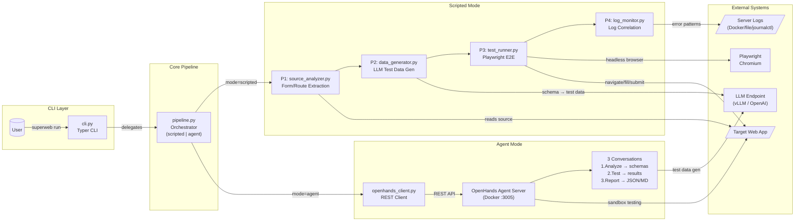

# SuperWeb Testing

**AI-driven E2E web application testing pipeline.** Analyzes source code, generates realistic test data, runs browser automation, and correlates results with server logs.

## Features

- **4-phase pipeline**: Source analysis → Data generation → Browser testing → Log correlation
- **Dual execution modes**:
  - `scripted` — Deterministic Playwright-based pipeline (default)
  - `agent` — OpenHands AI agent delegation (3-conversation workflow)
- **Source-aware test data**: Extracts form schemas, endpoints, and input validation rules from source code
- **LLM-powered generation**: Uses any OpenAI-compatible model
- **Structured output**: JSON results with timestamps, test data, and server log correlation

## Quick Start

```bash
# Install
pip install -e .

# Run full pipeline
superweb run --target http://localhost:8080 --source /path/to/source

# Dry run (analysis only)
superweb run --source /path/to/source --dry-run

# Source analysis only
superweb analyze --source /path/to/source

# Generate test data from existing schemas
superweb generate --schemas data/schemas.json
```

## CLI Reference

```bash
# Main pipeline
superweb run \
  --target http://localhost:8080 \
  --source /path/to/source \
  --output ./superweb_output \
  --llm-url http://localhost:8080 \
  --llm-model gpt-4 \
  --variations 3 \
  --mode scripted \
  --agent-timeout 600

# OpenHands container management
superweb openhands-start   # Start container on port 3005
superweb openhands-stop    # Stop container
superweb openhands-status  # Check status
```

## Architecture



### Scripted Mode

Runs the 4-phase pipeline deterministically:
1. **Analyze** — Scans source code for forms, routes, and input schemas
2. **Generate** — Creates N test data variations per form via LLM
3. **Test** — Executes Playwright browser tests with generated data
4. **Correlate** — Matches server logs to test results

### Agent Mode
Delegates to OpenHands Agent Server via 3 sequential conversations:
1. **Analyze** — AI examines source code and generates schemas + test data
2. **Test** — AI writes and runs Playwright tests
3. **Report** — AI compiles structured results

## Output

```
superweb_output/
├── data/
│   ├── schemas.json          # Extracted form schemas
│   ├── test_data.json        # Generated test data
│   └── test_results.json     # Browser test results
├── logs/
│   └── correlation_report.json  # Log correlation analysis
├── artifacts/              # Screenshots, DOM snapshots
└── agent_report.json       # Agent mode final report
```

## Requirements

### All Modes
- **Python 3.12+**
- **LLM endpoint** (OpenAI-compatible API). Must be reachable from your host machine.

### Scripted Mode Only
- **Playwright** browsers: `playwright install`

### Agent Mode — OpenHands Container

Agent mode requires the **OpenHands Agent Server** container. It is managed via `compose.yaml` in this repo and spawns ephemeral sandbox containers inside the OpenHands runtime.

#### Prerequisites

| Requirement | Notes |
|---|---|
| Docker & Docker Compose v2 | Container runtime + compose orchestration |
| Docker-in-Docker | OpenHands mounts `/var/run/docker.sock` to spawn sandbox containers |
| Accessible LLM | `LLM_BASE_URL` + `LLM_MODEL` env vars on the container (e.g. vLLM, OpenAI) |

#### Quick Setup

```bash
# 1. Configure your LLM endpoint in compose.yaml environment vars:
#    - LLM_BASE_URL=http://localhost:8080     # your LLM gateway
#    - LLM_MODEL=gpt-4                        # model name
#
# 2. Start the OpenHands container:
docker compose -f compose.yaml up -d
#
# 3. Verify it is healthy:
curl -s http://localhost:3005/health
# → {"status":"ok"}
#
# 4. Run the pipeline in agent mode:
python3 -m src.cli run --target http://host.docker.internal:8080 \
  --source /path/to/source --output ./superweb_test \
  --mode agent --agent-timeout 3600
#
# 5. Stop when done (optional — pipeline auto-stops):
docker compose -f compose.yaml down
```

#### How It Works

The `compose.yaml` mounts:
- `~/.openhands` → persistent agent data (SQLite, sessions)
- `./workspace/` → source code workspace (mounted as `/opt/workspace_base` inside the container)
- `/var/run/docker.sock` → Docker socket for sandbox container spawning

The `extra_hosts` entry (`host.docker.internal:host-gateway`) allows the OpenHands container to reach the target application running on your host machine. **Use `http://host.docker.internal:<port>` as your `--target` URL** so the agent can reach it from inside the sandbox.

#### Supported OpenHands Versions

Tested with **OpenHands Agent Server v1.30.0**. Newer versions may require payload alignment in `src/openhands_client.py`. The agent uses these tool names: `terminal`, `file_editor`, `write_file`, `read_file`, `edit`, `glob`, `grep`, `list_directory`.

#### Troubleshooting

| Symptom | Fix |
|---|---|
| `Connection refused` on `http://localhost:3005` | Container not running. Run `docker compose -f compose.yaml up -d`. |
| Agent finishes with 0 actions | LLM not reachable from inside the container. Verify `LLM_BASE_URL` env var points to an IP reachable from Docker (e.g., host-gateway). |
| `PermissionError` on workspace cleanup | Root-owned artifacts from a crashed prior run. Run `sudo rm -rf workspace/source workspace/artifacts`. |
| Agent can't reach target URL | Target URL resolves to IPv6 or loopback from inside the container. Use `http://host.docker.internal:<port>`. |

## Config (Optional)

Create `config.yaml` for persistent settings:

```yaml
target:
  url: "http://localhost:8080"

source:
  root: "/path/to/source"
  form_patterns: ["*.tsx", "*.py"]
  route_patterns: ["router.ts", "routes.ts"]

llm:
  base_url: "http://localhost:8080"
  model: "gpt-4"

browser:
  headless: true
  timeout_ms: 30000
  viewport:
    width: 1280
    height: 720

logs:
  type: "docker"
  docker_container: "myapp"
  error_patterns:
    - "ERROR"
    - "Exception"

pipeline:
  data_variations: 3
```

## License

MIT