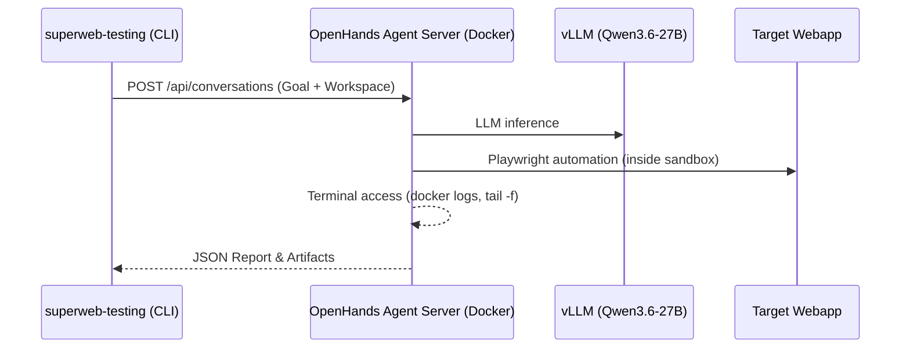

# OpenHands Integration Plan (Option 2: Docker + REST API)

## Goal
Integrate OpenHands as an external Agent Server via REST API. `superweb-testing` will delegate source comprehension, data generation, and dynamic test creation to OpenHands, while retaining its deterministic Playwright execution and log correlation. This keeps the package lean, decoupled, and CI/CD friendly.

## Architecture

## Prerequisites
- Docker & Docker Compose (OpenHands runtime)
- Local LLM (`http://172.25.0.1:8080`)
- `httpx` (already in `pyproject.toml`)

---

## Task 1: Docker Compose Setup
**Goal:** Define a reproducible OpenHands container that exposes a REST API.
**Files:** `compose.yaml`, `.gitignore`

- [ ] Create `compose.yaml`:
  - Service `openhands` (`ghcr.io/openhands/openhands:main`)
  - Map port `3005:3000` (Agent Server REST API, host port 3005)
  - Mount workspace volume: `./workspace:/workspace:rw`
  - Env vars: `LLM_BASE_URL=http://host.docker.internal:8080`, `LLM_MODEL=Qwen3.6-27B`
- [ ] Update `.gitignore`: Exclude `workspace/`, OpenHands internal cache (`~/.openhands`).

## Task 2: REST Client Module
**Goal:** Python client that manages the OpenHands lifecycle and task submission.
**Files:** `src/openhands_client.py`

- [ ] Create `OpenHandsClient` class:
  - `start_server()`: `subprocess.run(["docker", "compose", "up", "-d"])`
  - `wait_for_ready()`: Poll `GET /health` until container is accepting connections.
  - `create_conversation(goal: str, workspace: str)`: POST to REST API.
  - `poll_conversation(conv_id: str)`: Long-poll for completion or timeout.
  - `fetch_artifacts(conv_id: str)`: Retrieve generated JSON report and Playwright scripts.
  - `stop_server()`: `subprocess.run(["docker", "compose", "down"])`.

## Task 3: Pipeline Integration
**Goal:** Add `agent` mode to the pipeline that delegates phases 1 & 2 to OpenHands.
**Files:** `src/pipeline.py`

- [ ] Add `mode: str = "scripted"` to `Pipeline.__init__`.
- [ ] Refactor `run()`:
  - If `mode == "agent"`:
    1. Initialize `OpenHandsClient`.
    2. Construct goal prompt: `"Analyze {source_root}, extract forms/APIs, generate 3 variations of realistic test data, run Playwright tests against {target_url}, monitor docker logs for errors. Return structured JSON report."`
    3. Submit goal to OpenHands, poll for completion.
    4. Parse returned JSON report into `correlation_report.json`.
  - If `mode == "scripted"`: Retain existing regex/fallback logic.

## Task 4: CLI Updates
**Goal:** Expose OpenHands controls and execution modes via Typer.
**Files:** `src/cli.py`

- [ ] Add `--mode agent|scripted` flag to `superweb run`.
- [ ] Add `superweb openhands` group:
  - `start`: Start the OpenHands container (`compose up`).
  - `stop`: Stop the container (`compose down`).
  - `status`: `docker compose ps`.
- [ ] Ensure `superweb run --mode agent` automatically starts the container if not running.

## Task 5: Validation & Testing
**Goal:** Verify end-to-end agent-driven workflow.
**Files:** `tests/test_openhands_client.py`, `README.md`

- [ ] Unit tests for `OpenHandsClient` (mock HTTP endpoints).
- [ ] End-to-end test: Run `superweb run --source <loop_factory> --target http://localhost:8081 --mode agent`.
- [ ] Update `README.md`: Document Docker setup and agent mode usage.

---

## Dependencies Impact
- `pyproject.toml`: No heavy dependencies added. `openhands-sdk` is **not required** since we talk via raw REST API/HTTP. Only `httpx` and `subprocess` (stdlib) are needed.